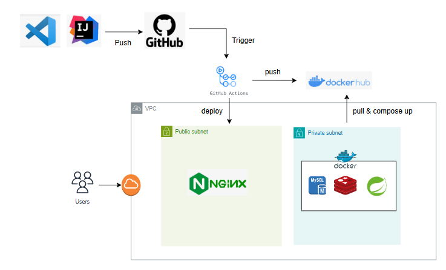

# Live Streaming Platform 🎥

이 웹 애플리케이션은 실시간 스트리밍 서비스를 제공하며, 호스트와 시청자가 간편하게 상호작용하며 스트리밍을 즐길 수 있도록 설계되었습니다.

또한, Spring Boot 3를 기반으로 WebSocket, STOMP, Redis Pub/Sub를 활용하여 안정적이고 효율적인 실시간 채팅 기능을 제공합니다.

---

### 배포 정보 🌐

1. 애플리케이션 접속:
   - **URL:** [크로플 스트리밍 페이지](https://crofle.store/streaming)
2. 접속 방법

- 프로젝트 ID를 입력하고, 역할(호스트/사용자)을 선택합니다.
- 사용자명(User Name)을 입력한 뒤 접속 버튼(Join Room)을 클릭합니다.

3. 기능 안내

- 실시간 채팅 메시지를 주고받을 수 있습니다.
- 호스트: 방송 시작 및 화면/음성 공유가 가능합니다.
- 사용자: 호스트의 화면과 음성을 실시간으로 시청할 수 있습니다.

## ☁️ 서버 아키텍쳐



## 🛠️ 기술 스택

### Frontend

- **Vue 3** (Composition API)
- **MediaSoup Client**
- **Socket.IO Client**
- **Vite**

### Backend

- **Spring Boot 3**
- **Spring WebSocket**
- **STOMP (Simple Text Oriented Messaging Protocol)**
- **Redis** (Pub/Sub 메커니즘(메시지 브로커) 활용)
- **Node.js**
- **MediaSoup**
- **Socket.IO**
- **Express**

### Deployment & Infrastructure

- **Nginx** (Reverse Proxy, Static File Hosting)
- **Certbot** (Let's Encrypt HTTPS 인증서 발급)
- **Docker** & **Docker Compose**
- **GitHub Actions** (CI/CD)
- **Docker** (Redis, MySQL, Spring Boot 컨테이너 실행)

---

## 🚀 주요 기능

- **실시간 비디오/오디오 스트리밍**
- **호스트/시청자 모드 지원**
- **실시간 채팅**
- **상품 정보 표시** (라이브 커머스 지원)
- **스트리밍 요약 정보 제공**

---

## 🛠️ 설치 및 실행

### 개발 환경

-- 클라이언트 실행

1. **프로젝트 클론**

   ```bash
   git clone [repository-url]
   cd [repository-folder]
   ```

2. **의존성 설치**

   ```bash
   npm install
   ```

3. **개발 서버 실행**

   ```bash
   npm run dev
   ```

4. **프로덕션 빌드**
   ```bash
   npm run build
   ```

-- 서버 실행

1. **의존성 설치**

   ```bash
   cd server
   ```

2. **의존성 설치**

   ```bash
   npm install
   ```

3. **개발 서버 실행**
   ```bash
   npm run dev # nodemon 실행
   ```

---

## 📂 프로젝트 구조

```
server/
  config/
    mediasoup.config.js           # MediaSoup 설정
  services/
    MediasoupService.js  # 미디어 서버 서비스
  models/
    Room.js               # 방 관리 클래스
    Peer.js               # 피어 관리 클래스
  server.js              # 메인 서버 파일
src/
  components/
    streaming/
      HostControls.vue      # 호스트 컨트롤 컴포넌트
      ViewerControls.vue    # 시청자 컨트롤 컴포넌트
      RemoteMedia.vue       # 원격 미디어 컴포넌트
      VideoPreview.vue      # 비디오 미리보기 컴포넌트
      RoomJoinForm.vue      # 방 입장 폼 컴포넌트
  composables/
    useStreaming.js         # 스트리밍 관련 컴포저블
    useMediasoup.js         # MediaSoup 관련 컴포저블
  views/
    StreamingRoom.vue       # 스트리밍 룸 페이지
```

---

## 🌟 사용 방법

### 방 입장

1. 역할 선택: **호스트** 또는 **시청자**
2. 프로젝트 ID 입력
3. **Join Room** 버튼 클릭
4. 채팅

### 호스트

- **방송 시작** 버튼으로 스트리밍 시작
- **방송 종료** 버튼으로 스트리밍 종료
- **방 나가기** 버튼으로 방 퇴장

### 시청자

- 호스트의 스트림을 실시간으로 시청
- **방 나가기** 버튼으로 방 퇴장

---

## ⚙️ 환경 변수

```env
VITE_SERVER_URL=http://localhost:4000  # 미디어서버 URL
```

---

## 🌍 브라우저 지원

- **Chrome** (권장)
- **Firefox**
- **Safari**
- **Edge**

---

## ⚠️ 주의사항

- **WebRTC 지원 브라우저 필요**
- **카메라/마이크 권한 필요**
- **안정적인 네트워크 연결 필요**

---

## 🌐 배포 및 CI/CD

### 1. Nginx와 Certbot 설정

#### **Nginx Reverse Proxy**

1. Nginx를 통해 정적 파일 서빙 및 백엔드 프록시 설정.
2. 예시 설정 파일:

   ```nginx
   server {
       listen 80;
       server_name crofle.store;
       location / {
            root {pwd}/dist; // build 폴더 경로
            index index.html;
            try_files $uri $uri/ /index.html =404;
       }

        <!-- 웹소켓 설정 -->
        location /ws {
           proxy_pass http://localhost:4000;
           proxy_http_version 1.1;
           proxy_set_header Upgrade $http_upgrade;
           proxy_set_header Connection 'upgrade';
           proxy_set_header Host $host;
           proxy_cache_bypass $http_upgrade;
       }
   }
   ```

#### **Certbot을 통한 HTTPS 적용**

1. Certbot 설치:

   ```bash
   sudo apt update
   sudo apt install certbot python3-certbot-nginx
   ```

2. 인증서 발급:

   ```bash
   sudo certbot --nginx -d your-domain.com
   ```

3. 인증서 자동 갱신 확인:
   ```bash
   sudo certbot renew --dry-run
   ```

---

### 2. GitHub Actions을 통한 CI/CD

#### **CI/CD Workflow**

GitHub Actions를 사용하여 자동 빌드 및 배포:

- **메인 브랜치**로 푸시 시 서버에 자동 배포.

```yaml
name: Vue.js CI/CD with Nginx
on:
  push:
    branches: ['main']
  pull_request:
    types:
      - closed
jobs:
  build:
    runs-on: ubuntu-latest
    steps:
      - name: SSH-deploy
        uses: appleboy/ssh-action@master
        with:
          host: ${{secrets.SERVER_HOST}}
          username: ${{secrets.SERVER_USER}}
          password: ${{secrets.SSH_PRIVATE_KEY}}
          port: 22
          script: |
            cd /root/sfu-server
            git pull origin main
            npm install --force
            npm run build
            nginx -s reload
```
